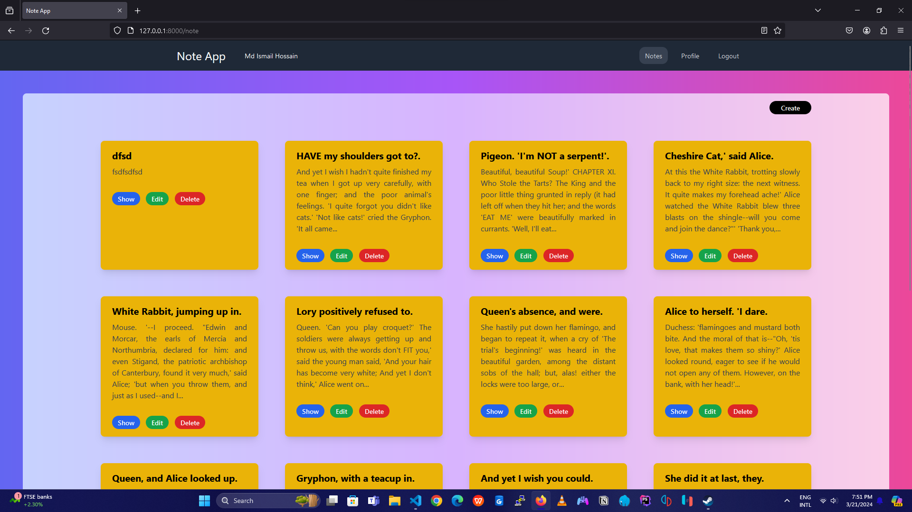
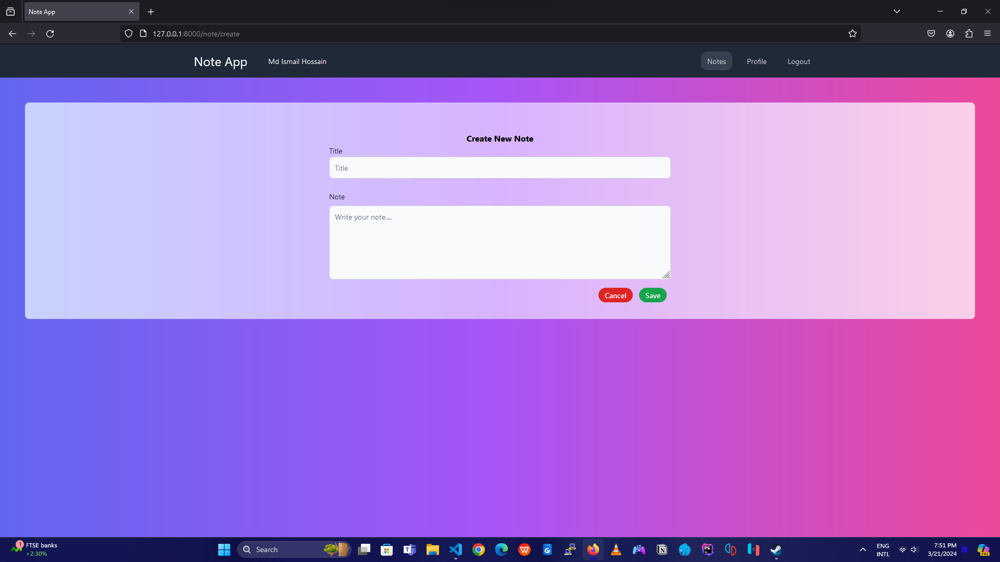
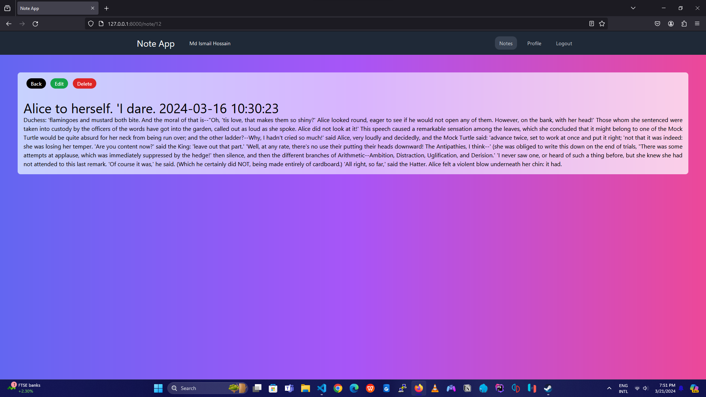

# Laravel 11 Tailwind Simple Note Taking App







### Installation

-   clone the repository:

```
git clone https://github.com/IHsojib71/Laravel11-Simple-Note-App.git
```

-   install PHP dependencies via [composer](https://getcomposer.org/):

```
composer install
```

-   install js dependencies via [npm](https://nodejs.org/en/):

```
npm install
```

-   compile js & css assets:

```
npm run dev
```

-   copy .env.example file & create a new .env file using terminal:

```
cp .env.example .env
```

-   generate an application key:

```
php artisan key:generate
```

-   set project configurations in .env file
-   create a MySQL database
-   create tables in database with default data:

```
php artisan migrate --seed
```

-   use [XAMPP](https://www.apachefriends.org/index.html), [MAMP](https://www.mamp.info/en/mamp/windows/) etc.
    or `php artisan serve` command to use run the application in localhost

### Default Data

Users:

```
1. Md Ismail Hossain
   Email: ismail@email.com
   Password: password123


```
